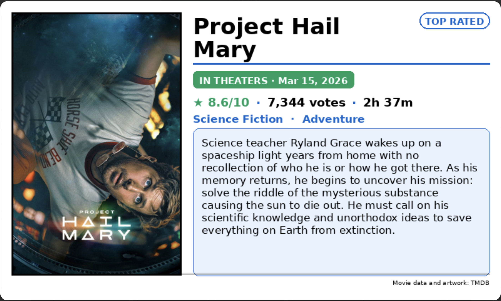
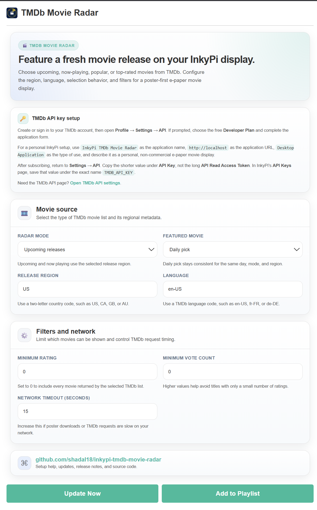

# InkyPi TMDb Movie Radar

An InkyPi plugin that displays a featured upcoming, now-playing, popular, or top-rated movie from TMDb.

_TMDb Movie Radar_ is a plugin for [InkyPi](https://github.com/fatihak/InkyPi) that connects to The Movie Database (TMDb) using an API key, retrieves movie metadata and poster artwork, and renders a poster-first movie card on your e-paper display.

## Install

Use the InkyPi plugin installer with the plugin ID and this repository URL.

```bash
inkypi plugin install tmdb_movie_radar https://github.com/Shadal18/inkypi-tmdb-movie-radar
```

## Update

To update the plugin on your InkyPi device:

1. SSH into your InkyPi host.
2. Change into the plugin directory:
   ```bash
   cd ~/InkyPi/src/plugins/tmdb_movie_radar
   ```
3. Run this update command:
   ```bash
   git pull origin main && \
   if [ -d tmdb_movie_radar ]; then \
     rsync -a tmdb_movie_radar/ ./ && \
     rm -rf tmdb_movie_radar; \
   fi && \
   sudo systemctl restart inkypi.service
   ```

If you do not see your changes after updating:

- Confirm you are in the correct plugin folder.
- Hard refresh the InkyPi web UI.
- Check the InkyPi logs for plugin import or runtime errors.
- Confirm the InkyPi device has internet access and can reach TMDb.

## Requirements

- A working InkyPi installation with plugin support.
- Internet access from the InkyPi device.
- A free TMDb account with a Developer Plan application.
- A TMDb **API Key** stored in InkyPi as `TMDB_API_KEY`.
- Network access from the InkyPi device to `api.themoviedb.org` and TMDb's image service.

## Features

This plugin is an extension for the InkyPi e-paper display frame and includes the following features:

- Displays one featured movie with official TMDb poster artwork.
- Supports Upcoming Releases, Now Playing, Popular Movies, and Top Rated Movies modes.
- Shows movie title, release status, release date, TMDb rating, vote count, runtime, genres, and overview.
- Supports a daily featured selection that remains stable throughout the day.
- Supports first-result selection or a random movie on each refresh.
- Supports release-region selection, such as US, CA, GB, or AU.
- Supports language selection, such as `en-US`, `fr-FR`, or `de-DE`.
- Supports optional minimum rating and minimum vote-count filters.
- Uses a poster-first editorial layout designed for six-color Waveshare displays.
- Uses blue as an information accent, green for highly rated or in-theater movies, yellow for movies releasing this week, and red for movies releasing today.
- Shows a graceful error screen when TMDb, poster artwork, or the API key is unavailable.
- Keeps TMDb API credentials outside plugin settings by using InkyPi API Keys.
- Includes required TMDb attribution in the display footer.

## Settings

The plugin settings page lets you customize:

- Movie radar mode: Upcoming Releases, Now Playing, Popular Movies, or Top Rated Movies.
- Featured movie selection: Daily Pick, First Result, or Random on Refresh.
- Release region.
- TMDb metadata language.
- Minimum movie rating.
- Minimum vote count.
- TMDb and poster-download request timeout.

## TMDb Setup

This plugin authenticates with TMDb using the shorter **API Key** shown in your TMDb API settings. It does not use the longer API Read Access Token.

### Create a TMDb account

1. Open [TMDb](https://www.themoviedb.org/).
2. Create a free account or sign in to an existing account.
3. Open your profile menu in the upper-right corner.
4. Click **Settings**.
5. Select **API** in the Settings sidebar.

### Subscribe to the free Developer Plan

If TMDb shows **Upgrade Subscription** or asks you to create an application, select the free **Developer Plan** and complete the form.

Use the following suggested application values for a personal InkyPi installation:

| Form field          | Suggested value                                                                                                                   |
| ------------------- | --------------------------------------------------------------------------------------------------------------------------------- |
| Application Name    | `InkyPi TMDb Movie Radar`                                                                                                         |
| Application URL     | `http://localhost`                                                                                                                |
| Type of Use         | `Desktop Application`                                                                                                             |
| Application Summary | `A personal, non-commercial InkyPi e-paper display plugin that shows upcoming and currently playing movie information from TMDb.` |

Enter your real contact information in the required contact fields, accept TMDb's listed terms, and click **Subscribe**.

TMDb should return you to the **Settings → API** page after the subscription is created.

### Copy the correct TMDb credential

On the TMDb API settings page, you will see two credentials:

- **API Read Access Token**: A long token intended for Bearer-token authentication. Do **not** use this value with the current plugin.
- **API Key**: A shorter key shown below the API Read Access Token. Use **this** value with TMDb Movie Radar.

Copy the value under **API Key** only.

Do not share the key in screenshots, GitHub commits, support tickets, or chat messages. Treat it like a password.

### Add the key in InkyPi

1. Open the InkyPi web UI.
2. Click the **key icon** to open API Keys.
3. Add a new environment key named:
   ```text
   TMDB_API_KEY
   ```
4. Paste the short TMDb **API Key** as the value.
5. Save the key.
6. Open the TMDb Movie Radar plugin settings.
7. Configure your preferred movie mode and display options.
8. Save the plugin settings and refresh the display.

The key name must be exactly `TMDB_API_KEY`.

### Test the API key

TMDb provides a credential-testing link on the API settings page. You can also test the plugin directly from InkyPi after saving the key.

If the plugin shows **TMDb API key was rejected**:

- Confirm you copied the short value below **API Key**.
- Do not use the longer **API Read Access Token**.
- Confirm the InkyPi key name is exactly `TMDB_API_KEY`.
- Confirm your TMDb Developer Plan subscription is active.
- Save the key again in InkyPi and refresh the plugin.

If you accidentally expose your key, use TMDb's **Regenerate Key** option and immediately replace the value stored in InkyPi.

## Add the plugin in InkyPi

1. Open the InkyPi web UI.
2. Add the **TMDb Movie Radar** plugin to a playlist or open it directly.
3. Select the movie radar mode.
4. Choose a featured-movie selection method.
5. Set the release region and language.
6. Optionally set rating and vote-count filters.
7. Save the plugin settings.
8. Refresh the display or restart InkyPi if needed.

## How it works

The plugin queries TMDb's movie-list endpoints using the selected radar mode:

```text
/movie/upcoming
/movie/now_playing
/movie/popular
/movie/top_rated
```

It chooses a movie from the returned results, requests the selected movie's full details, downloads its TMDb poster artwork, and renders the result for the connected e-paper display.

For **Daily Pick**, the plugin derives a stable selection from the current date, selected mode, selected region, and returned movie list. The movie therefore remains the same for normal refreshes on that day, rather than changing every time the display updates.

The plugin uses the display resolution reported by InkyPi and scales the poster, metadata, and overview layout to fit the configured panel orientation.

## Notes and limitations

- The InkyPi device must have internet access.
- TMDb availability, artwork, titles, release dates, ratings, genres, and runtime data depend on TMDb's current data.
- Upcoming and Now Playing results can vary based on the selected release region.
- A movie may not have poster artwork, a release date, runtime, rating, genre, or overview available.
- If poster artwork cannot be downloaded, the plugin renders a `NO POSTER` placeholder instead.
- The selected movie list can change as TMDb updates its catalog and rankings.
- Very long movie titles or overviews may be wrapped or truncated to fit the e-paper display.
- The plugin uses TMDb data and artwork under TMDb's terms and includes TMDb attribution in the rendered footer.
- This product uses the TMDB API but is not endorsed or certified by TMDB.

## Troubleshooting

- **Missing API key**
  - Open InkyPi API Keys using the key icon.
  - Confirm the key name is exactly `TMDB_API_KEY`.
  - Confirm the saved value is not blank.
  - Restart InkyPi after changing API Keys if the plugin does not immediately pick up the key.

- **TMDb API key was rejected**
  - Confirm you used the shorter **API Key** from TMDb Settings → API.
  - Do not use the longer **API Read Access Token**.
  - Confirm the Developer Plan application is active in your TMDb account.
  - Confirm the key was copied without leading or trailing spaces.
  - Regenerate the TMDb key if it may have been exposed, then update `TMDB_API_KEY` in InkyPi.

- **Could not connect to TMDb**
  - Confirm the InkyPi device has internet access.
  - Confirm DNS can resolve `api.themoviedb.org`.
  - Check firewall, proxy, Pi-hole, VLAN, and outbound HTTPS restrictions.
  - Increase the request-timeout setting if the connection is slow.

- **No movies matched your filters**
  - Lower the minimum rating.
  - Lower the minimum vote count.
  - Try a different movie radar mode.
  - Confirm the selected region and language are valid.

- **Poster does not load**
  - The plugin will still display movie information with a `NO POSTER` placeholder.
  - Confirm the InkyPi device can reach TMDb's image service.
  - Check DNS, firewall rules, and outbound HTTPS access.
  - Increase the request timeout if poster downloads are slow.

- **Plugin does not load after updating**
  - Validate the Python file:
    ```bash
    cd ~/InkyPi/src
    python3 -m py_compile plugins/tmdb_movie_radar/tmdb_movie_radar.py
    ```
  - Restart InkyPi:
    ```bash
    sudo systemctl restart inkypi.service
    ```
  - Review recent logs:
    ```bash
    sudo journalctl -u inkypi.service -n 150 --no-pager
    ```

## Security and privacy

- The plugin connects directly to TMDb's API and image servers.
- `TMDB_API_KEY` is stored in InkyPi API Keys rather than plugin settings.
- The plugin does not upload display data, settings, or API credentials to another service.
- TMDb movie metadata, poster artwork, and release information are displayed on the physical e-paper screen.
- Treat your TMDb API key as a password.
- If your key is exposed, regenerate it in TMDb and update it in InkyPi immediately.

## Repository

GitHub repository:

[https://github.com/Shadal18/inkypi-tmdb-movie-radar](https://github.com/Shadal18/inkypi-tmdb-movie-radar)

## Screenshots

- Main Movie Radar display with poster artwork, movie metadata, and overview.
- Plugin settings screen.

<p align="center">
  
  
</p>
